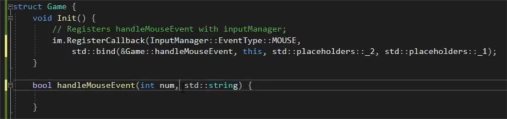
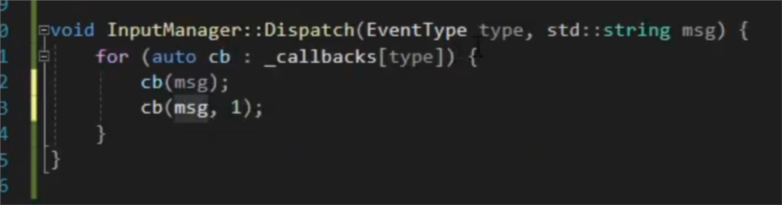
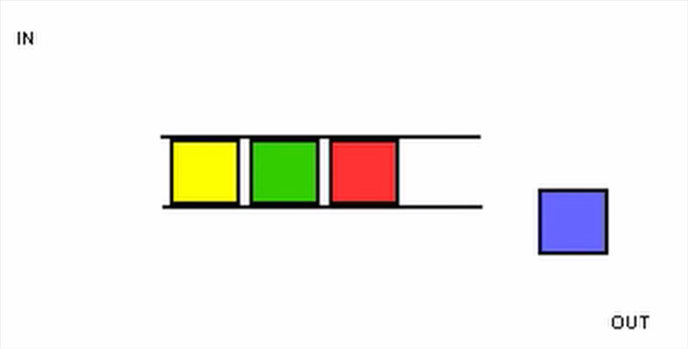

## Описание содержимого директорий:

# c++20
Представлны небольшие примеры кода, использующие новые возможности языка.

1) __modules__ - пример создания и использования пользовательских модулей, а так же их внедрения в CMakeLists.txt

2) __spaceship operator__ - пример новвоведений и содержиния __#inclede <compare>__. Дано краткое описание strong, weak, partial ordering, а так же как можно использовать <=> в классах для определения 6ти операторов сравнения.

3) __overloading with spaceship operator__ - дан пример реализации модуля, описывающего 3Д вектор, а так же использования <=>. Так как мы использовали не  std::partial_ordering operator<=>(const Vector3& rhs) const = default, а определи свой, то нужно определить и оператор ==

4) __function pointer__  - пример создания модуля (разделение на интерфейс и реализацию модуля), а так же пример создания логики callback через 
4.1) указатель на функцию - реализация с использованием "сырых" указателей на функции void (*)(...) имеет существенное ограничение: вы не можете напрямую зарегистрировать нестатический метод класса (например, Game::HandleMouseEvent из main.cpp) в качестве колбэка, так как такие методы требуют скрытый параметр this.
4.2) std::function  - для использования методов класса, нужно добавлять их следующим образом: std::bind(&Game::HandleMouseEvent, this, std::placeholders::_1), где td::placeholders::_1 означает передать в функцию колбека первый параметр метода класса. (например можно передать из одной функции в другую аргументы в другом порядке)
         

    4.3) object member function
    4.4) lambdas 

# c++thread 

1) command ordering - данный проект реализует очередь из задач на выполнение. Мы можем доставать задачу и начинать ее выполнение в новом потоке, а так же ложить новую задачу в конец очереди.

Используюьтся: std::thread, std::thread.joinable() std::thread.join() 
 std::unique_lock  - для блокировки при доступе к очереди и параметру флага
     std::condition_variable  - для засыпания потока и освобождения мьютекса, пока нет задача  

